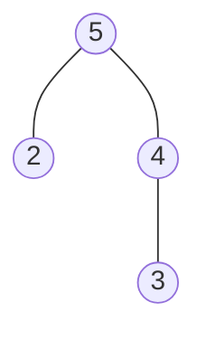
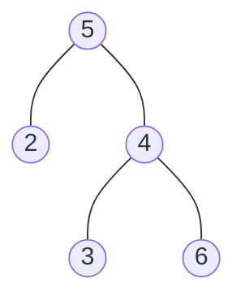
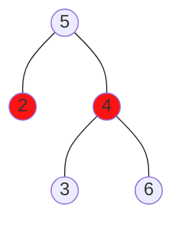
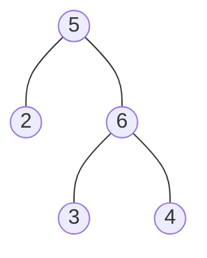

# heap
----
* tree-like data structure
* (max) *heap invariant*
  * root of heap > all children
  * all children are (max) heaps
----
* heap has:
  * `push`: append and item to heap while maintaining heap invariant
  * `top`: inspect value of root
  * `pop`: remove and return root from heap while maintaining heap invariant
----

# add 6

----

----

----
