# Huffman Encoding
---

* Given alphabet $\mathcal{A}$
* Character α has <!-- .element: class="fragment" -->
    * `freq(α)` <!-- .element: class="fragment" -->
    * `len(α)` <!-- .element: class="fragment" -->
---
* Fixed-Length Character *encoding scheme*
    * function from $\mathcal{A}$ to $\\{0, 1\\}^k$ 
    * i.e., maps a character to some binary string <!-- .element: class="fragment" -->
Note: this function must be injective. Cannot map two different characters to the same binary string!
----
* Example: `chars = [a, b, c, d, e, f]` <!-- .element: class="fragment" -->

| char | freq | codeword |
| ---- | ---- | -------- |
| a    | 0.05 | 000      |
| b    | 0.1  | 001      |
| c    | 0.2  | 010      |
| d    | 0.2  | 011      |
| e    | 0.4  | 100      |
| f    | 0.05 | 101      |

* How many bits needed for fixed-length encoding?  <!-- .element: class="fragment" -->
----
<!-- .slide:  data-transition="none" -->

 

| char | freq | codeword |
| ---- | ---- | -------- |
| a    | 0.05 | 000      |
| b    | 0.1  | 001      |
| c    | 0.2  | 010      |
| d    | 0.2  | 011      |
| e    | 0.4  | 100      |
| f    | 0.05 | 101      |

 

* decode `101000011`: 
  * $101000011$ <!-- .element: class="fragment" -->

----
<!-- .slide:  data-transition="none" -->

 

| char | freq | codeword |
| ---- | ---- | -------- |
| a    | 0.05 | 000      |
| b    | 0.1  | 001      |
| c    | 0.2  | 010      |
| d    | 0.2  | 011      |
| e    | 0.4  | 100      |
| f    | 0.05 | 101      |

 

* decode `101000011`: 
  * $\underbrace{101}_{\text{f}}000011$

----
<!-- .slide:  data-transition="none" -->

| char | freq | codeword |
| ---- | ---- | -------- |
| a    | 0.05 | 000      |
| b    | 0.1  | 001      |
| c    | 0.2  | 010      |
| d    | 0.2  | 011      |
| e    | 0.4  | 100      |
| f    | 0.05 | 101      |

 

* decode `101000011`: 
  * $101\underbrace{000}_{\text{a}}011$

----
<!-- .slide:  data-transition="none" -->

| char | freq | codeword |
| ---- | ---- | -------- |
| a    | 0.05 | 000      |
| b    | 0.1  | 001      |
| c    | 0.2  | 010      |
| d    | 0.2  | 011      |
| e    | 0.4  | 100      |
| f    | 0.05 | 101      |

 

* decode `101000011`: 
  * $101000\underbrace{011}_{\text{d}}$

----
<!-- .slide:  data-transition="none" -->

| char | freq | codeword |
| ---- | ---- | -------- |
| a    | 0.05 | 000      |
| b    | 0.1  | 001      |
| c    | 0.2  | 010      |
| d    | 0.2  | 011      |
| e    | 0.4  | 100      |
| f    | 0.05 | 101      |

* decode `101000011`: 
  * $\underbrace{101000011}_{\text{fad}}$

----

<!-- .slide: data-auto-animate -->

<!-- .element: data-id="code-animation" -->

| char | freq | codeword |
| ---- | ---- | -------- |
| a    | 0.05 | 000      |
| b    | 0.1  | 001      |
| c    | 0.2  | 010      |
| d    | 0.2  | 011      |
| e    | 0.4  | 100      |
| f    | 0.05 | 101      |

* encode `bad`: 
  * $\texttt{b} \to 001$ <!-- .element: class="fragment" -->
  * $\texttt{a} \to 000$ <!-- .element: class="fragment" -->
  * $\texttt{d} \to 011$ <!-- .element: class="fragment" -->
* $\texttt{bad} \to 001000011$ <!-- .element: class="fragment" -->

----
* Average code length
    * $$\texttt{cost}(E) = \sum_{\alpha\in\mathcal{A}} \texttt{freq}(\alpha)\cdot\texttt{len}(\alpha)$$ <!-- .element: class="fragment" -->
* Bounded below by Entropy: <!-- .element: class="fragment" -->
    * $$\texttt{entropy}(\mathcal{A}) = \sum_{\alpha\in\mathcal{A}} \texttt{freq}(\alpha)\cdot\log\left(\frac{1}{\texttt{freq}(\alpha)}\right)$$ <!-- .element: class="fragment" -->
----
<!-- .slide: data-transition="none" -->

* For fixed length encoding, average code length is just length

| char | freq | codeword |
| ---- | ---- | -------- |
| a    | 0.05 | 000      |
| b    | 0.1  | 001      |
| c    | 0.2  | 010      |
| d    | 0.2  | 011      |
| e    | 0.4  | 100      |
| f    | 0.05 | 101      |

* $3 \cdot 0.05 + 3 \cdot 0.1 + \dots + 3 \cdot 0.05$ <!-- .element: class="fragment" -->
----
<!-- .slide: data-transition="none" -->

* For fixed length encoding, average code length is just length

| char | freq | codeword |
| ---- | ---- | -------- |
| a    | 0.05 | 000      |
| b    | 0.1  | 001      |
| c    | 0.2  | 010      |
| d    | 0.2  | 011      |
| e    | 0.4  | 100      |
| f    | 0.05 | 101      |

* $=3\left(0.05 + 0.1 + \dots + 0.05\right)\phantom{11}$
----
<!-- .slide: data-transition="none" -->

* For fixed length encoding, average code length is just length

| char | freq | codeword |
| ---- | ---- | -------- |
| a    | 0.05 | 000      |
| b    | 0.1  | 001      |
| c    | 0.2  | 010      |
| d    | 0.2  | 011      |
| e    | 0.4  | 100      |
| f    | 0.05 | 101      |

* $=3\cdot 1\phantom{111111111111111111111}$
----
<!-- .slide: data-transition="none" -->

* For fixed length encoding, average code length is just length

| char | freq | codeword |
| ---- | ---- | -------- |
| a    | 0.05 | 000      |
| b    | 0.1  | 001      |
| c    | 0.2  | 010      |
| d    | 0.2  | 011      |
| e    | 0.4  | 100      |
| f    | 0.05 | 101      |

* $=3\phantom{11111111111111111111111}$
---
* Some chars are more frequent than others 
* More frequent chars should use less space <!-- .element: class="fragment" -->
* Variable length encoding <!-- .element: class="fragment" -->
    * A function from $\mathcal{A}$ to $\\{0, 1\\} \cup \\{0, 1\\}^2 \cup \dots \cup \\{0, 1\\}^k$ <!-- .element: class="fragment" -->
    * i.e., maps character to binary sequences of different lengths <!-- .element: class="fragment" -->
----
| char | codeword |
| ---- | -------- |
| a    | 0        |
| b    | 1        |
| c    | 10       |
| d    | 11       |

* Is above valid? <!-- .element: class="fragment" -->

* Decode `0110`:

----
<!-- .slide: data-transition="none" -->

* Decode `0110`:
* $\underbrace{0}_{\text{a}}110$ <!-- .element: class="fragment" -->

----
<!-- .slide: data-transition="none" -->

* Decode `0110`:
* $0\underbrace{11}_{\text{d}}0$

----
<!-- .slide: data-transition="none" -->

* Decode `0110`:
* $011\underbrace{0}_{\text{a}}$

----
<!-- .slide: data-transition="none" -->

* Decode `0110`:
* $\underbrace{0110}_{\text{ada}}$

----

<!-- .slide: data-transition="none" -->

* Decode `0110`:
* $\underbrace{0110}_{\text{ada}}$
* $\underbrace{0}_{\text{a}}110$ <!-- .element: class="fragment" -->
----

<!-- .slide: data-transition="none" -->

* Decode `0110`:
* $\underbrace{0110}_{\text{ada}}$
* $0\underbrace{1}_{\text{b}}10$
----
<!-- .slide: data-transition="none" -->

* Decode `0110`:
* $\underbrace{0110}_{\text{ada}}$
* $01\underbrace{1}_{\text{b}}0$
----
<!-- .slide: data-transition="none" -->

* Decode `0110`:
* $\underbrace{0110}_{\text{ada}}$
* $011\underbrace{0}_{\text{a}}$
----

<!-- .slide: data-transition="none" -->

* Decode `0110`:
* $\underbrace{0110}_{\text{ada}}$
* $\underbrace{0110}_{\text{abba}}$
----

<!-- .slide: data-transition="none" -->

* Decode `0110`:
* $\underbrace{0110}_{\text{ada}}$
* $\underbrace{0110}_{\text{abba}}$
* Which is it?
----
* To avoid ambiguity, use *prefix code* 
    * Prefix property: no codeword can be the prefix of another codeword <!-- .element: class="fragment" -->

 <!-- .element: class="fragment" -->

| char | freq | codeword |
| ---- | ---- | -------- |
| a    | 0.05 | 0        |
| b    | 0.1  | 10       |
| c    | 0.2  | 110      |
| d    | 0.2  | 1110     |
| e    | 0.4  | 11110    |
| f    | 0.05 | 11111    |

* What is the Average Code Length? <!-- .element: class="fragment" -->
* `0.05 * 1 + 0.1 * 2 + ... + 0.05 * 5 = 3.9` <!-- .element: class="fragment" -->
* Much worse than entropy (2.22) <!-- .element: class="fragment" -->
    * Can we do better? <!-- .element: class="fragment" -->

---

## Huffman Algorithm

* Create a binary tree:
  * Begin with all characters as leaves <!-- .element: class="fragment" -->
  * Take the two characters with lowest frequency <!-- .element: class="fragment" -->
    * `a`, `b` <!-- .element: class="fragment" -->
  * Combine them into a new character <!-- .element: class="fragment" -->
    * Add `ab` as internal node with children `a` and `b` <!-- .element: class="fragment" -->
    * `freq(ab) = freq(a) + freq(b)` <!-- .element: class="fragment" -->
  * Repeat until there is only one character remaining <!-- .element: class="fragment" -->
----

<!-- .slide: data-transition="none" -->

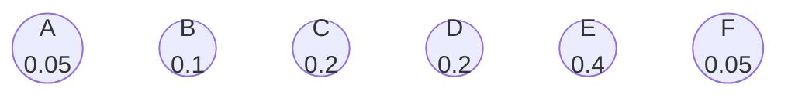
----

<!-- .slide: data-transition="none" -->

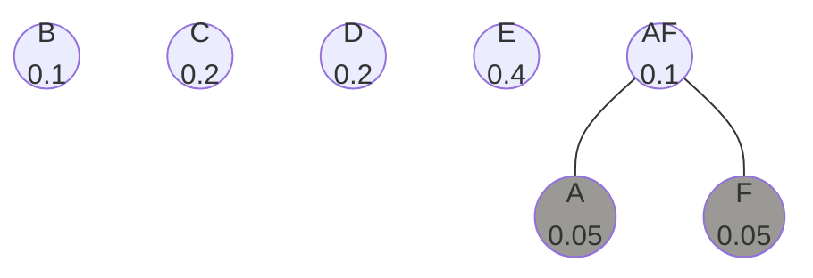
----

<!-- .slide: data-transition="none" -->

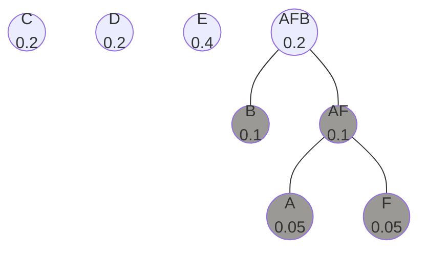
----

<!-- .slide: data-transition="none" -->

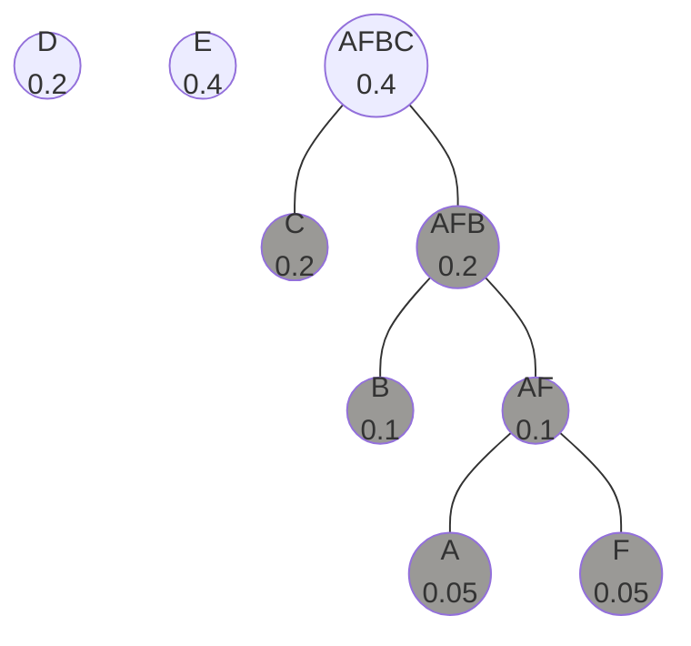
----
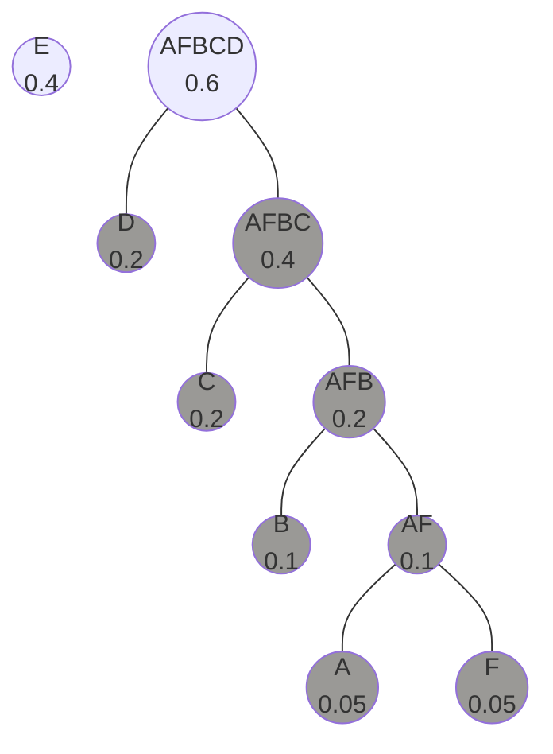
----
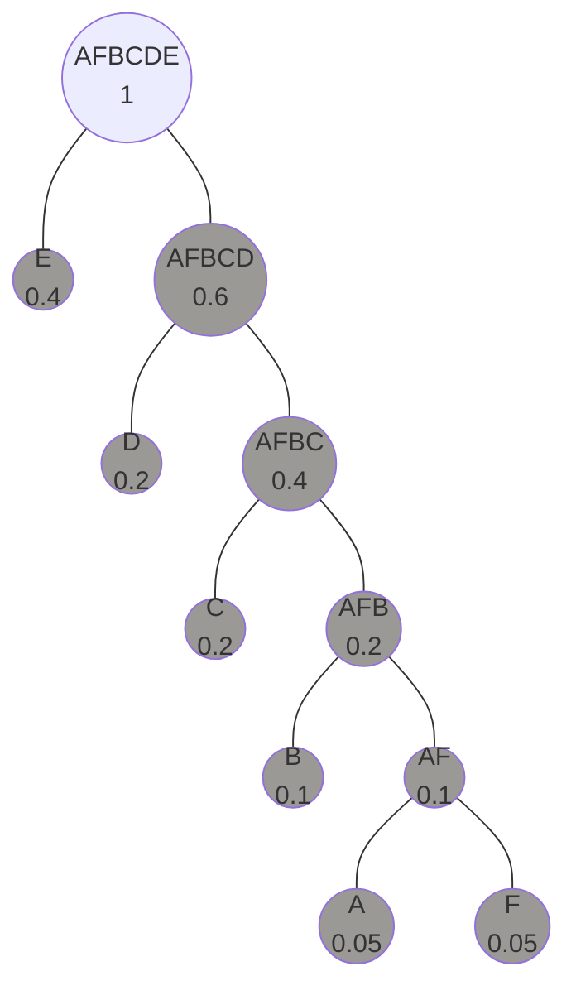
----
* How to *use* the tree to
  * encode?
  * decode?
* Start at the root
  * Left subtree is 0
  * Right subtree is 1
----
# Letter "f" codeword

---

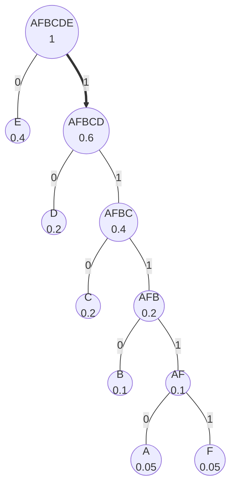
----

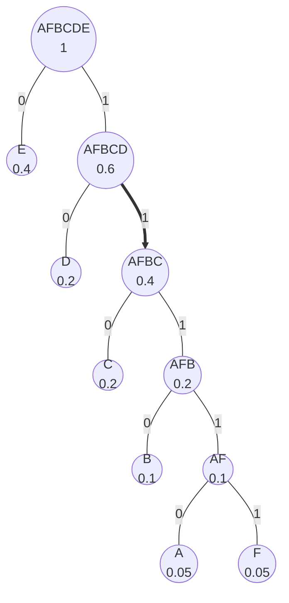
----

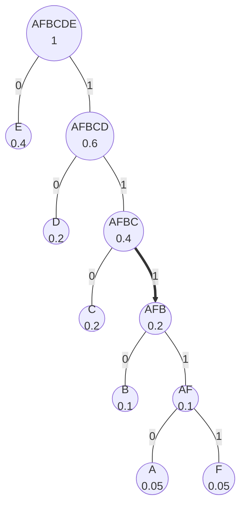
----

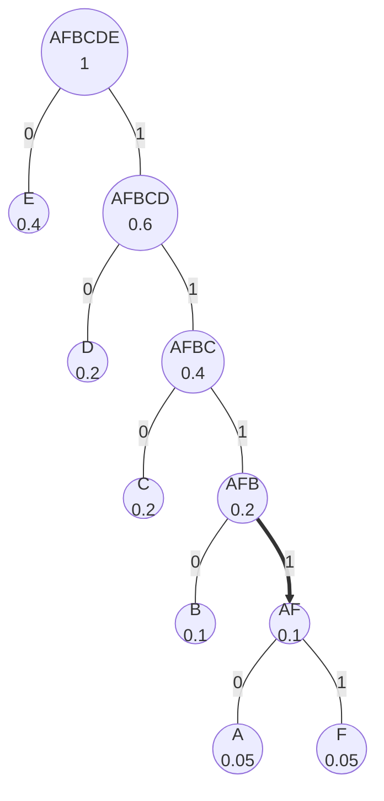
----

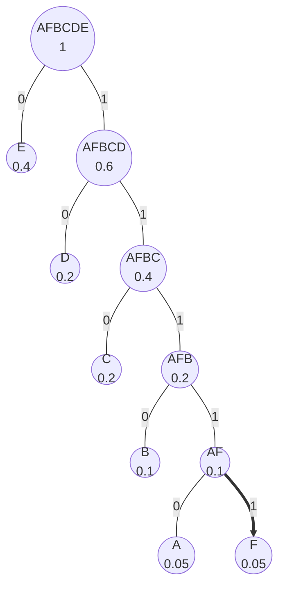
----

| char | freq | codeword |
| ---- | ---- | -------- |
| a    | 0.05 | 11110    |
| b    | 0.1  | 1110     |
| c    | 0.2  | 110      |
| d    | 0.2  | 10       |
| e    | 0.4  | 0        |
| f    | 0.05 | 11111    |

----

* Average code length:
    * `0.05 * 5 + 0.1 * 4 + 0.2 * 3 + 0.2 * 2 + 0.4 * 1 + 0.05 * 5`
----

* Average code length:
    * `=2.3`
* This is optimal!
* Entropy = 2.2 is a *lower bound*, there may be no encoding that reaches it
